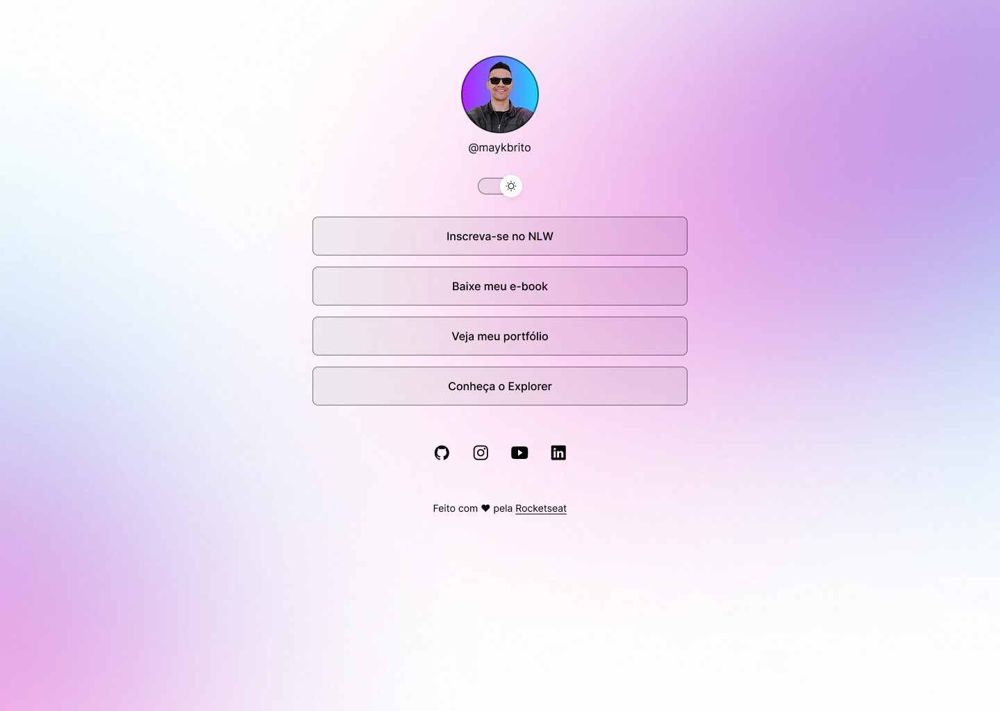

# DevLinks - Seu Cartão de Visita Digital



## 📋 Sobre o Projeto

DevLinks é um agregador de links profissional, funcionando como um cartão de visita digital. O projeto apresenta um design moderno e responsivo, com suporte a tema claro/escuro e animações suaves.

## Funcionalidades
- Página única (SPA) feita com HTML, CSS e JavaScript puro
- Alternância entre modo claro e escuro (Light/Dark Mode) com animação
- Imagem de perfil dinâmica conforme o tema
- Links para redes sociais (Linkedin, Instagram, Github)
- Ícones interativos e responsivos
- Deploy automático via GitHub Actions para GitHub Pages

## 🛠️ Tecnologias Utilizadas

- HTML5
- CSS3 (com variáveis CSS e animações)
- JavaScript
- Ion Icons para ícones
- GitHub Pages para deploy

## Estrutura de Pastas
```
DevLinks/
├── index.html                # Página principal
├── README.md                 # Documentação do projeto
├── .github/
│   └── workflows/
│       └── deploy.yml        # Workflow de deploy automático
└── src/
    ├── assets/               # Imagens, ícones e recursos visuais
    │   ├── profile_blue_background.png
    │   ├── profile_yellow_background.png
    │   ├── moon-switch.svg
    │   ├── sun-switch.svg
    │   ├── bg-mobile.jpg
    │   └── bg-mobile-light.png
    ├── styles/
    │   └── style.css         # Estilos da página e temas
    └── scripts/
        └── script.js         # Lógica do switch de tema e troca de imagem
```

## Como funciona o modo claro/escuro?
- O botão de alternância (switch) troca a classe do `<html>` entre `light-mode` e padrão
- O CSS aplica variáveis diferentes para cada tema
- O JavaScript troca a imagem de perfil conforme o tema

## Deploy automático
- O projeto é publicado automaticamente no GitHub Pages a cada push na branch `main`
- Workflow configurado em `.github/workflows/deploy.yml` usando a action `peaceiris/actions-gh-pages`

## Como rodar localmente
1. Clone o repositório:
   ```sh
   git clone https://github.com/gschneider04/DevLinks.git
   ```
2. Abra o arquivo `index.html` no navegador

## Demonstração
Acesse o site publicado em: [https://gschneider04.github.io/DevLinks/](https://gschneider04.github.io/DevLinks/)

## 🤝 Contribuições

Contribuições são bem-vindas! Sinta-se à vontade para:
- Reportar bugs
- Sugerir novas funcionalidades
- Enviar pull requests

## 👨‍💻 Autor

- [@gschneiderdev](https://github.com/gschneider04)
- [LinkedIn](https://www.linkedin.com/in/schneidergustavo/)

⭐ Se você gostou deste projeto, considere dar uma estrela no GitHub!

---

Projeto para estudos, portfólio e compartilhamento de links. Sinta-se à vontade para contribuir!
